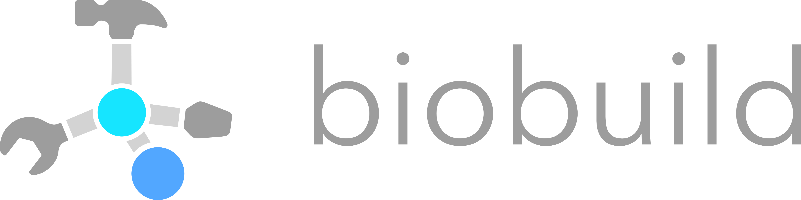

.. Glycosylator documentation master file, created by
   sphinx-quickstart on Wed Dec 21 15:02:18 2022.
   You can adapt this file completely to your liking, but it should at least
   contain the root `toctree` directive.

Biobuild
========

Glycosylator is built on top of Biobuild. Biobuild is a general-purpose fragment-based molecular assembly framework that can be used to build any kind of molecular structure. 
It is designed to be modular, extensible, and easy to use. As a consequence, Glycosylator can actually build more than just glycans!
Biobuild is written in Python and has integrations with many other popular libraries such as RDKit or Openbabel. 
Biobuild is available on GitHub at <link needed>.